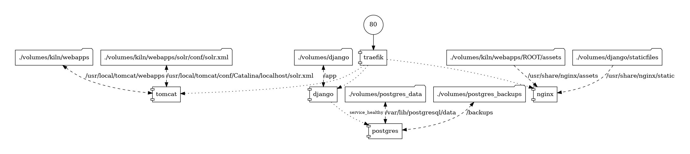

# Records of Early English Drama (REED)

Records of Early English Drama (REED) is an international research collaboration
that is establishing for the first time the context from which the drama of
Shakespeare and his contemporaries grew.

The project is [TEI XML](https://tei-c.org/)-based
published via [Apache Cocoon](https://cocoon.apache.org/), a
[Tomcat](https://tomcat.apache.org/) web application. The project has
been containerised using [Docker Compose](https://docs.docker.com/compose/) to
enhance deployment efficiency and sustainability. The containerised setup
comprises five main services: a [Traefik](https://traefik.io/traefik/) reverse
proxy, a Tomcat server, a [Django](http://djangoproject.com/) application, a
[Postgres](http://postgresql.org/) database, and an
[nginx](https://www.nginx.com/) server.

1. [`traefik`](https://hub.docker.com/_/traefik): This
   service acts as a reverse proxy, dynamically routing incoming HTTP requests
   to the appropriate backend services based on the requested hostname and path.
   It ensures that traffic is directed correctly and efficiently within the
   application infrastructure.
1. [`tomcat`](https://hub.docker.com/_/tomcat): This service hosts the
   Java-based web application. It is responsible for processing and delivering
   dynamic content generated from the TEI XML data.
1. [`django`](https://hub.docker.com/_/python): This service runs the Django web
   application framework, which is used for developing the backend of the
   project.
1. [`postgres`](https://hub.docker.com/_/postgres): This service runs the
   PostgreSQL database. It stores all the data for the Django application.
1. [`nginx`](https://hub.docker.com/_/nginx): This service is dedicated to
   serving static assets, images, and other resources required by the web
   application. By offloading the delivery of static content to a separate
   server, it improves the overall performance and responsiveness of the web
   application.

Below is a diagram of the Docker Compose stack architecture:



## Get Started

Follow these steps to set up and run the project using Docker Compose.

**Note** that these instructions cover only the local setup.

### Pre-requisites

Before you begin, ensure you have the following installed on your system:

- [Docker](https://www.docker.com/products/docker-desktop/)
- [Docker Compose](https://docs.docker.com/compose/)

### Running the application

1. **Clone this repository**
1. **Set up the Docker Compose file**

   Rename `docker-compose.override.yml.example` to
   `docker-compose.override.yml`. This file contains customizations necessary
   for running the stack in a local development environment.

1. **Set up the environment file**

   Create a `.env` file inside the compose directory with the following content:

   ```sh
   # Set to true in production environments
   PRODUCTION=false

   # HTTP ports for the reverse proxy
   TRAEFIK_HTTP_PORT=80
   TRAEFIK_HTTPS_PORT=443

   # Django settings
   DJANGO_ADMINS=("eREED Admin", "reeduoft@gmail.com")
   DJANGO_SERVER_EMAIL=reeduoft@gmail.com
   DJANGO_DEFAULT_FROM_EMAIL=reeduoft@gmail.com
   # Use a strong and unique key in production
   DJANGO_SECRET_KEY=generate_secret_key

   # PostgreSQL settings
   # In production, use Docker secrets or environment variables managed by the orchestrator
   DATABASE_HOST=postgres
   DATABASE_PORT=5432
   DATABASE_DB=database_name
   DATABASE_USER=database_user
   DATABASE_PASSWORD=database_pwd

   # Hosts settings
   VIRTUAL_HOSTS=localhost,127.0.0.1
   ```

   Ensure to replace database_name, database_user, and database_pwd with your
   actual database credentials.

1. **Start the services**

   Use Docker Compose to build and start the services:

   ```sh
   docker compose up --build
   ```

1. **Access the application**

   Once all services are running, you can access the web application via your
   web browser at [http://localhost/](http://localhost/).

1. **Load data into the database**

   Get a copy of the database data and make sure it is compressed with `gzip`,
   place the file in `volumes/postgres_backups` and run the command:

   ```sh
   docker compose exec postgres restore db_backup_name.sql.gz
   ```

   If you get the error `dropdb: error: database removal failed: ERROR:  
database "ereed" is being accessed by other users` when running the command,
   stop the django service `docker compose stop django` and run the restore
   command again.

   After restoring a database backup it is recommended to stop and restart the
   whole Docker stack.

1. **Stop the services**

   To stop the application press CTRL+C in the same terminal window where the
   compose script is running. Or in a different terminal window:

   ```bash
    docker compose stop
   ```

### User authentication

To protect the `/admin` URL with user authentication on the servers, follow
these steps:

1. Create a passwords file named `.htpasswd` using the
   [htpasswd](https://httpd.apache.org/docs/current/programs/htpasswd.html) tool.
   Note, that there is already a passwords file in the project server.
1. Place the `.htpasswd` file in the `/volumes/traefik/` directory.

## Server deployment

> **Note:** When running Docker Compose commands on the server, use the `-p`
> flag to specify which instance to run the command on. It helps distinguish
> between multiple deployments, such as development, staging, and production
> environments, by providing a unique name for each instance. This ensures that
> Docker Compose commands target the correct set of services and configurations
> specific to that instance.
>
> For example to run the database restore command on the production instance:
>
> ```sh
> docker compose -p reedprod exec postgres restore db_backup_name.sql.gz
> ```

Server deployment for the is automated using GitLab CI. The process involves
running a pipeline that performs the following steps:

1. **Configure CI/CD variables**:

   - **HTPASSWD**: Passwords, masked and base64 encoded.
   - **HOST**: The server hostname or IP address.
   - **HOST_ENV**: The server environment variables, masked and base64 encoded.
   - **SSH_KNOWN_HOSTS**: A file variable containing the known hosts for SSH
     connections.
   - **SSH_PRIVATE_KEY**: A file variable containing the private key for SSH
     authentication.
   - **SSH_USER**: The username used for SSH connections.

1. **SSH into the project server**: The pipeline creates a secure SSH connection
   to the project server using the provided SSH variables.
1. **Clone the repository**: Once connected, the repository is cloned from the
   remote GitLab repository to ensure the latest version of the code is deployed.
1. **Run Docker Compose**: The pipeline executes Docker Compose commands to
   start up the services defined in the docker-compose.yml file.

This automated process, runs on commit/push to the repository, ensures that the
latest code is deployed efficiently and consistently to the server. **At the
moment only commits to the docker branch will get deployed.**

## Backups and data export

To create backups and export EATS data, follow these instructions:

### Backups

To create a backup of the PostgreSQL database, use the following command:

```sh
docker compose exec postgres backup
```

Backups are stored in the `/volumes/postgres_backups` directory.

### Exporting data from EATS

To export EATS entity data, use the following command:

```sh
docker compose exec django python manage.py eats_export_entities
```

Exported data is stored in the `/volumes/eats_exports` directory.
